# Journal of project mecha-organic

### *2025-05-22*

---
### general design sketch + rough calculations 

working out body design, flutes, and a display?
- flap design
- tube & flute sizes
- fan size & flow
- time display

(also glorious tea)
will definetly do custom pcb for this

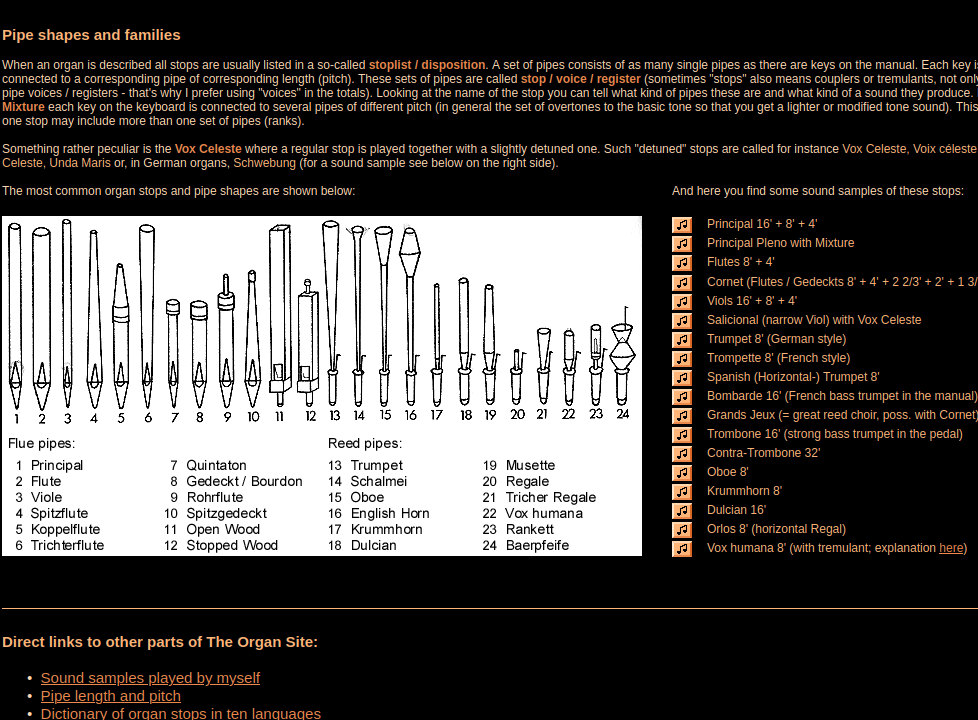

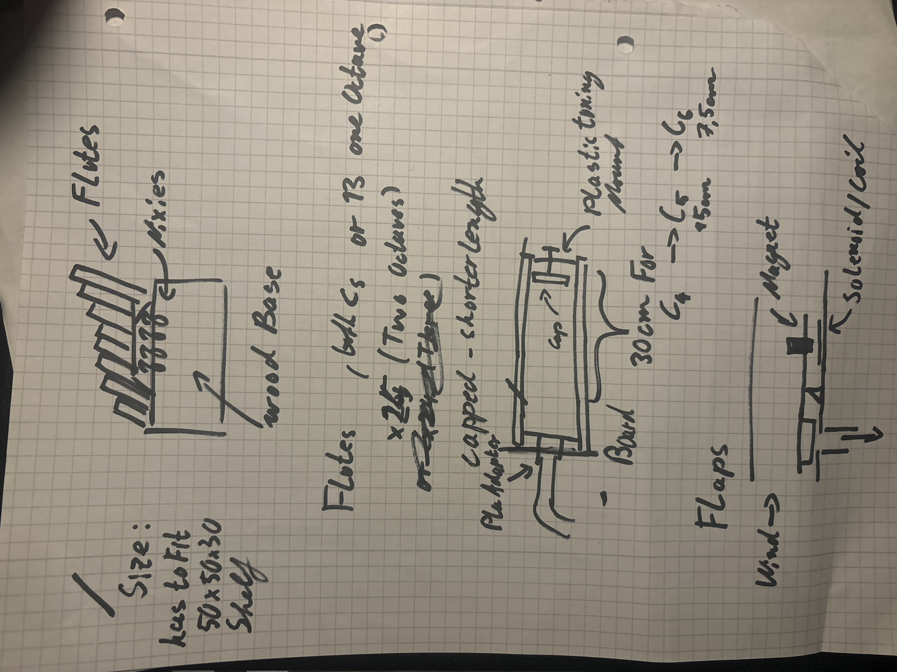

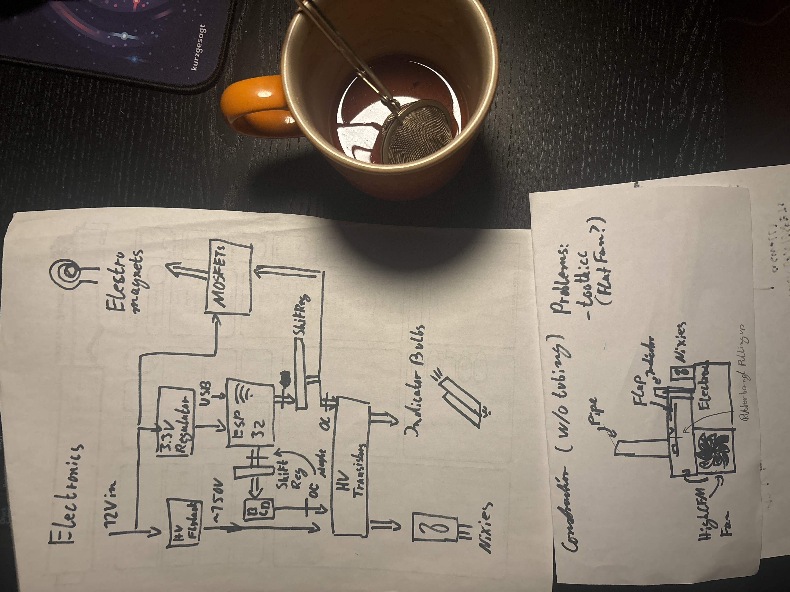

#### 3h

---

 

### *2025-05-23*

---
### airflow components

none of the fans on ali have pressure/airflow information 😭
probably something like this https://a.aliexpress.com/_EuHVSgW
or this https://www.amazon.de/ARCTIC-S12038-8K-120x120x38-reguliert-Anschluss/dp/B09VGS3LND/
also i need a pressure sensor up to 20mmWC / 5kPa, gonna use the BMP280 (extremly overkill precision but very cheap)

#### 1h

---

 

---
### making a test flute

Since the first one didnt work (i messed up how a flute works T.T), i made one that just uses a premade glass tube as a resonator .
ill probably use a 3d printed socket and a wooden resonator tube in the final design aswell. also i looked at some 3d printed flute designs on thingyverse

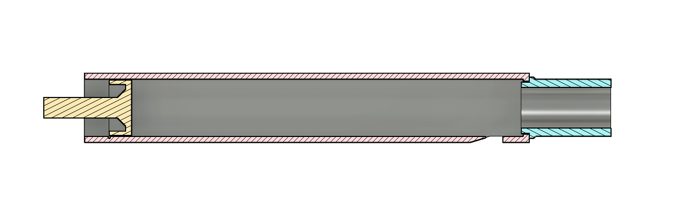

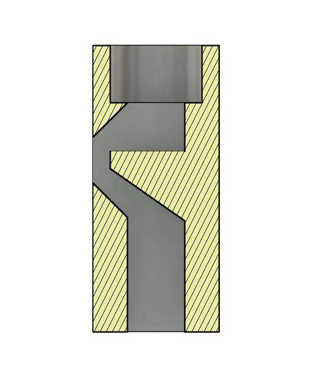

#### 1h

---

 

---
### Attempt #3 at actual sounds + a bit of Electronics

why is this so hard ughhhh nothing is making any sound.
https://michaelkrzyzaniak.com/organ_pipe_maker/ this looks very very useful for sizings everything correctly, will try again tomorrow

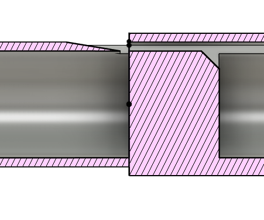

#### 1.5h

---

 

### *2025-05-24*

---
### actually calculating proper dimensions for once lol

http://www.fonema.se/ising/isint.htm
https://en.wikipedia.org/wiki/Organ_flue_pipe_scaling
- and omg would you look at that it actually worked(3rd attempt or sth) (paper used as cap to double resonator length because i didnt print the

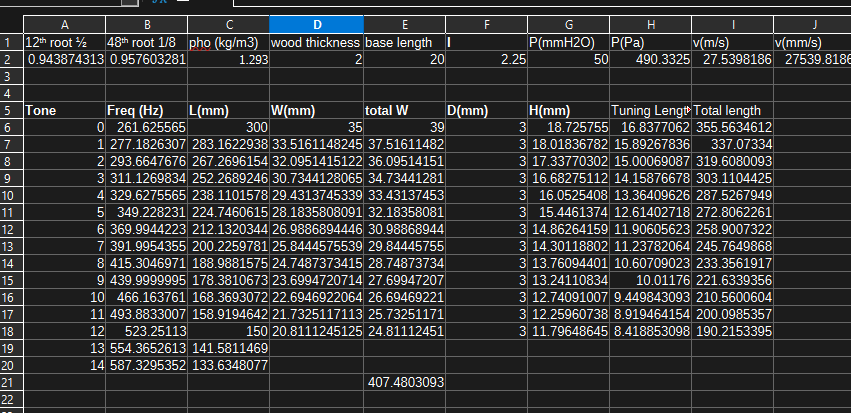

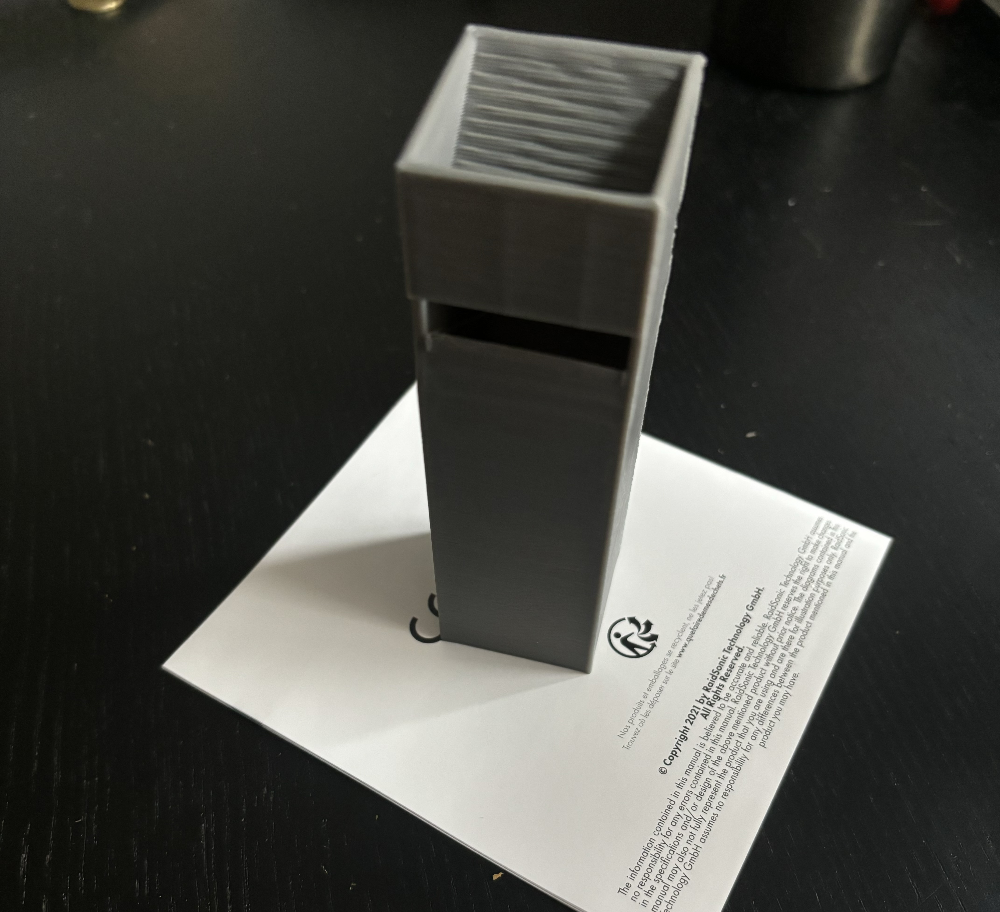

#### 2.5h

---

 

---
### testing coils

Since solenoids are pretty expensive (and on ali almost everything i found has a max amount of 1) im just gonna directly integrate coils into the mechanism 

tested some magnets i had lying around with a coil:
required force for 16mm round hole @ 50mmWC pressure is about 10g
testing with 600 windings of 34AWG produced just about 11g of force at 12V (and 1.7W), with about 3mm of travel (which isnt great but close enough that it might work with a few other parameters)
I also tried where the coil is pushing instead of pulling, and got to a peak of 13g. this configuration is a lot better cause most of the force is needed at the beginning of the stroke, which this would provide. Ideally ill get to ~ 20g and use a third class lever to provide greater travel and opening speed. However this is achievable in a lot of ways, meaning i can keep designing for now.

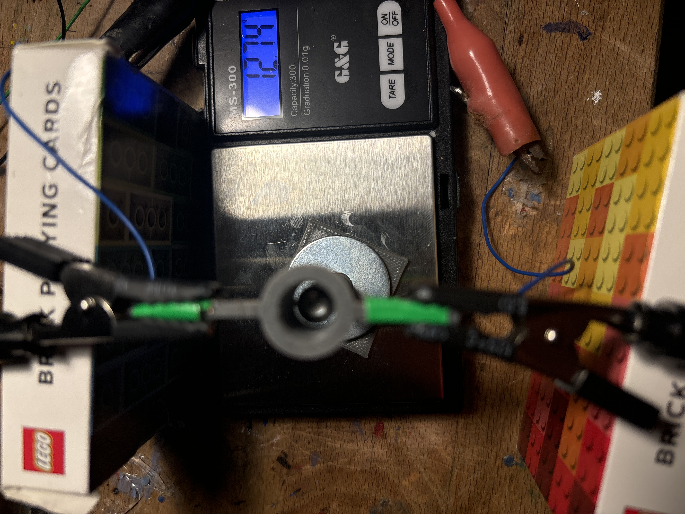

#### 3h

---

 

### *2025-05-25*

---
### I found proper solenoids :P

checking them out rq, these seem ideal 
https://a.aliexpress.com/_Ew177CE
although they are a bit overpowered at almost 10W, i wonder if i can pwm them or maybe use 5v for the whole thing?
started looking for mosfets & drivers already aswell, although ill probably finish rough design of the pipes before i continue with the PCB

#### 0.5h

---

 

---
### boop

some more testing with pipes aswell as trying to figure out how to properly design things with wood sheets in fusion
+ started designing the circuit in kicad

#### 2.5h

---

 

### *2025-05-27*

---
### some more testing with pipe dimensions 

wasnt home yesterday so no work there

#### 0.5h

---

 

### *2025-05-30*

---
### yippie more circuit design

not worth designing own step up&down converters, so im just gonna use modules from ali for that

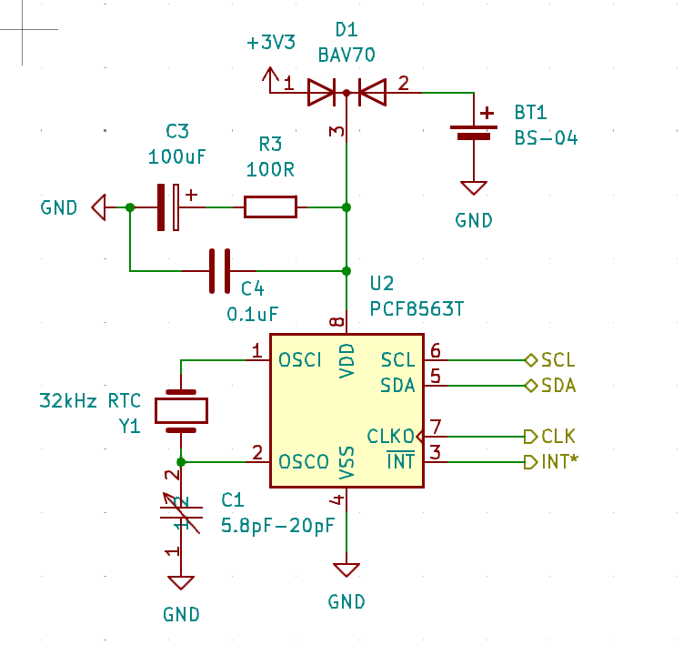

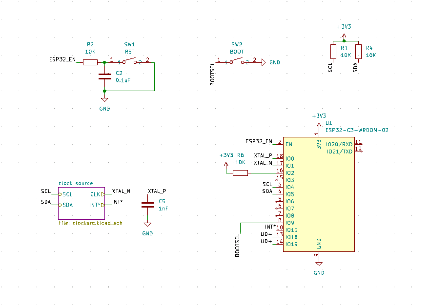

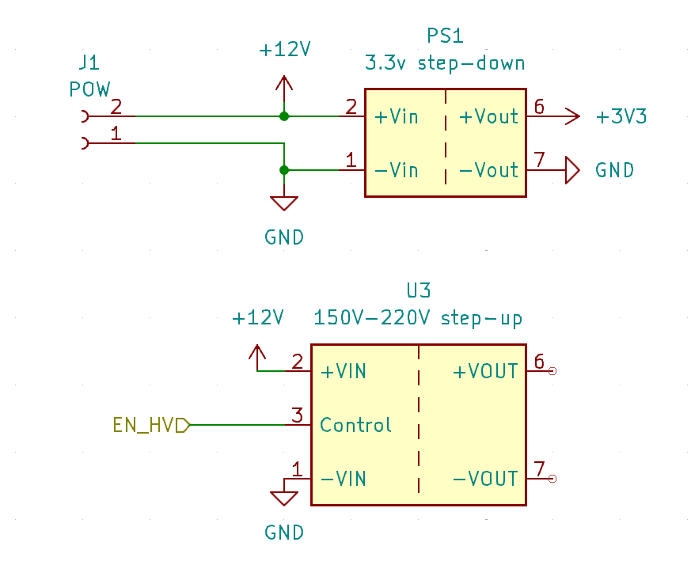

#### 3h

---

 

---
### dont we love more flute testing

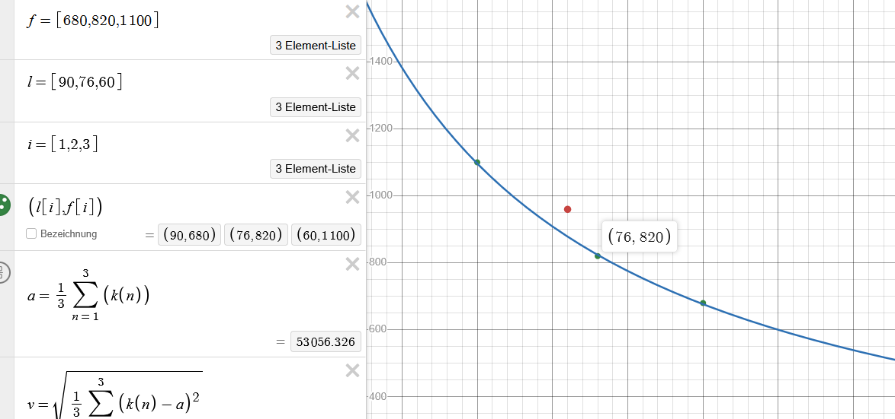

#### 1.5h

---

 

